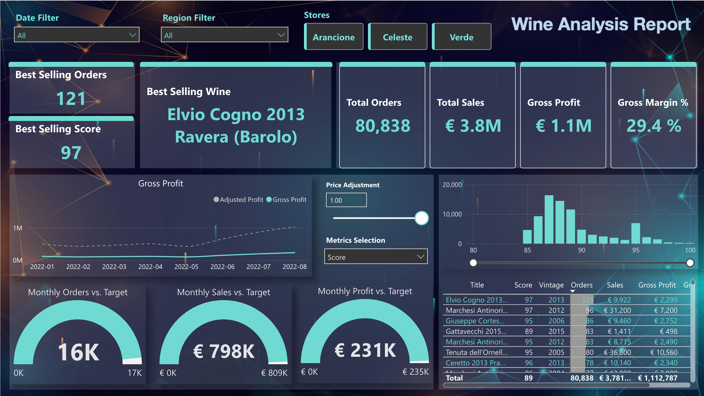

# Wine Sales Analysis on Azure

A comprehensive data engineering and analytics solution for wine sales data using Azure Data Factory, Azure Data Lake Storage, and Microsoft Fabric, implementing a medallion (Bronze-Silver-Gold) data architecture pattern.

## Table of Contents

1. [Project Overview](#project-overview)
2. [Project Architecture](#project-architecture)
3. [Key Technologies](#key-technologies)
4. [Data Pipeline Flow](#data-pipeline-flow)
5. [Dataflows](#dataflows)
6. [Project Structure](#project-structure)
7. [Analytics & Reporting](#analytics--reporting)
8. [Getting Started](#getting-started)

---

## Project Overview

This project implements an end-to-end data pipeline for processing and analyzing wine sales data across multiple online retailers. The solution follows a medallion architecture pattern, transforming raw data through Bronze, Silver, and Gold layers, ultimately enabling analytics and reporting through Microsoft Fabric.

### Key Features

- **Data Ingestion**: Automated extraction and decompression of source data files
- **Data Transformation**: Multi-layer data processing with validation and error handling
- **Data Quality**: Currency conversion, data validation, and error row capture
- **Data Storage**: Delta Lake format for efficient analytics
- **Business Intelligence**: Power BI semantic model and interactive reports

---

## Project Architecture


## Power BI Reports



The solution follows a medallion architecture pattern:

- **Landing Zone**: Raw data files (ZIP format) are stored in Azure Data Lake Storage
- **Bronze Layer**: Raw, unprocessed data after extraction
- **Silver Layer**: Cleaned, validated, and enriched data from multiple sources
- **Gold Layer**: Business-ready, aggregated data in Delta format for analytics
- **Analytics Layer**: Microsoft Fabric Lakehouse, Semantic Model, and Power BI Reports

---

## Key Technologies

### Azure Services

- **Azure Data Factory (ADF)**: Orchestrates data pipelines and executes data transformations
  - Mapping Data Flows for code-free data transformations
  - Pipeline orchestration with dependency management
  - Integration with Azure Data Lake Storage Gen2

- **Azure Data Lake Storage Gen2 (ADLS Gen2)**: Primary data storage
  - Hierarchical namespace for efficient data organization
  - Support for multiple data formats (CSV, JSON, Parquet, Delta)
  - Medallion architecture implementation (Bronze/Silver/Gold folders)

- **Microsoft Fabric**: Unified analytics platform
  - **Lakehouse**: Unified data lake and data warehouse for analytics
  - **Semantic Model**: DirectLake connection to Lakehouse data
  - **Power BI Reports**: Interactive dashboards and visualizations

### Data Formats

- **CSV**: Source data format for raw and intermediate data
- **JSON**: Source data format for Verde store data
- **Parquet**: Intermediate storage format for Silver layer
- **Delta Lake**: Final storage format for Gold layer (ACID transactions, time travel, schema evolution)

### Data Processing

- **Mapping Data Flows**: Visual, code-free data transformation pipelines
- **Data Validation**: Assertions, filtering, and error handling
- **Data Enrichment**: Currency conversion, date transformations, column derivations
- **Data Aggregation**: Monthly aggregations, joins, and data consolidation

---

## Data Pipeline Flow

The main pipeline (`00_main`) orchestrates the following sequence of operations:

### 1. Data Ingestion (`01_pl_unzipandcopy`)
- **Purpose**: Extract ZIP files from landing zone and copy to Bronze layer
- **Source**: `wine-project/landing/sampledata.zip`
- **Destination**: `wine-project/medallion/bronze/`
- **Activities**: Binary copy with ZIP decompression

### 2. Metadata Processing (`03_pl_silvertogold_metadata`)
- **Purpose**: Process master data files (Currency, Dates, Exchange Rates, Stores, Territory)
- **Dataflow**: `df_CopyCsvMetadataToGold`
- **Transformations**:
  - Read CSV files from Bronze layer
  - Add load timestamps
  - Cast data types
  - Write to Delta format in Gold layer
- **Outputs**: 
  - `medallion/gold/currency`
  - `medallion/gold/dates`
  - `medallion/gold/currency_rate`
  - `medallion/gold/stores`
  - `medallion/gold/territory`

### 3. Product Data Processing (`03_pl_silvertogold_productdata`)
- **Purpose**: Process product data with website/store identification
- **Dataflows**: 
  - `df_AddColumnToProduct`: Adds website column derived from filename
  - `df_CopyBronzeToGoldProduct`: Transforms and loads to Gold layer
- **Transformations**:
  - Extract website name from filename
  - Cast data types
  - Filter null ProductIds
  - Rename website column to Store
- **Output**: `medallion/gold/product` (Delta format)

### 4. Sales Data Processing - Bronze to Silver

#### 4a. Celeste Store (`02_pl_bronzetosilverForCeleste`)
- **Dataflow**: `df_CopyBronzeToSilverForCeleste`
- **Source**: CSV files from `medallion/bronze/Celeste`
- **Transformations**:
  - Filter summary lines
  - Aggregate monthly quantities
  - Validate currency (EUR/GBP assertion)
  - Join with currency rates for GBP conversion
  - Convert GBP to EUR using exchange rates
  - Error row capture
- **Output**: `medallion/silver/Celeste` (Parquet format)

#### 4b. Arancione Store (`02_pl_bronzetosilverForArancione`)
- **Dataflow**: `df_CopyBronzeToSilverArancione`
- **Source**: CSV files from `medallion/bronze/Arancione`
- **Transformations**: Similar to Celeste with store-specific logic

#### 4c. Verde Store (`02_pl_bronzetosilverForVerde`)
- **Dataflow**: `df_CopyBronzeToSilverForVerde`
- **Source**: JSON files from `medallion/bronze/Verde`
- **Transformations**: JSON parsing and transformation

### 5. Sales Data Aggregation (`03_pl_silvertogold_saledata`)
- **Purpose**: Consolidate sales data from Silver to Gold layer
- **Dataflow**: `df_CopySilverToGoldSalesData`
- **Source**: Parquet files from `medallion/silver/salesdata/`
- **Transformations**:
  - Read all Silver sales data
  - Add load timestamps
  - Convert to Delta format
- **Output**: `medallion/gold/sales` (Delta format)

### 6. Final Aggregation (`04_gold_agg`)
- **Purpose**: Join sales data with product data and create processed sales dataset
- **Dataflow**: `df_gold_agg_sales`
- **Transformations**:
  - Join sales data with product data (matching on Variety, Title, Vintage)
  - Filter null ProductIds
  - Aggregate product data to resolve multiple ProductIds
  - Create processed sales dataset with ProductId
- **Output**: `medallion/gold/processed_sales` (Delta format)

---

## Dataflows

The project uses 8 main dataflows for data transformation:

### Metadata Dataflows

#### `df_CopyCsvMetadataToGold`
- **Purpose**: Transform master data files from CSV to Delta format
- **Inputs**: 5 CSV files (Currency, Dates, Exchange Rates, Stores, Territory)
- **Transformations**: Type casting, timestamp addition
- **Outputs**: 5 Delta tables in Gold layer

### Product Dataflows

#### `df_AddColumnToProduct`
- **Purpose**: Add website/store column to product data
- **Source**: CSV files from Bronze ProductData folder
- **Transformation**: Derive website name from filename (substring operation)
- **Output**: Parquet files with website column

#### `df_CopyBronzeToGoldProduct`
- **Purpose**: Transform product data to Gold layer
- **Source**: Parquet files from Bronze layer
- **Transformations**:
  - Add load timestamp
  - Select and rename columns (website → Store)
  - Cast data types
  - Filter null ProductIds
- **Output**: Delta table in Gold layer

### Sales Dataflows (Bronze to Silver)

#### `df_CopyBronzeToSilverForCeleste`
- **Purpose**: Transform Celeste store sales data
- **Key Features**:
  - Monthly quantity aggregation
  - Currency validation (EUR/GBP)
  - Currency rate join and conversion
  - Error row handling
- **Output**: Parquet files in Silver layer

#### `df_CopyBronzeToSilverArancione`
- **Purpose**: Transform Arancione store sales data
- **Similar structure to Celeste dataflow**

#### `df_CopyBronzeToSilverForVerde`
- **Purpose**: Transform Verde store sales data (JSON format)
- **Source**: JSON files
- **Output**: Parquet files in Silver layer

### Sales Aggregation Dataflows

#### `df_CopySilverToGoldSalesData`
- **Purpose**: Consolidate sales data from Silver to Gold
- **Source**: Parquet files from Silver layer
- **Transformation**: Add load timestamp
- **Output**: Delta table in Gold layer

#### `df_gold_agg_sales`
- **Purpose**: Create processed sales dataset with ProductId
- **Sources**: 
  - Sales data (Delta)
  - Product data (Delta)
- **Transformations**:
  - Aggregate product data by Variety, Title, Vintage to get minimum ProductId
  - Join sales with aggregated products
  - Filter records with null ProductId
  - Select final columns
- **Output**: `medallion/gold/processed_sales` (Delta format)

---

## Project Structure

```
Azure_git/
├── adls/                          # Local ADLS folder structure
│   └── wine_project/
│       ├── landing/               # Landing zone (raw ZIP files)
│       └── medallion/
│           ├── bronze/           # Raw, unprocessed data
│           ├── silver/           # Cleaned and validated data
│           └── gold/             # Business-ready aggregated data
│
├── data_factory_wine/             # Azure Data Factory configuration
│   ├── dataflow/                  # Mapping Data Flow definitions
│   │   ├── df_AddColumnToProduct.json
│   │   ├── df_CopyBronzeToGoldProduct.json
│   │   ├── df_CopyBronzeToSilver*.json
│   │   ├── df_CopyCsvMetadataToGold.json
│   │   ├── df_CopySilverToGoldSalesData.json
│   │   └── df_gold_agg_sales.json
│   │
│   ├── dataset/                   # Dataset definitions
│   │   ├── adls_csv_*.json       # CSV dataset definitions
│   │   ├── adls_json_*.json      # JSON dataset definitions
│   │   ├── adls_parquet_*.json   # Parquet dataset definitions
│   │   └── ErrorRows.json
│   │
│   ├── linkedService/             # Linked service definitions
│   │   └── ADLS_linked_service.json
│   │
│   ├── pipeline/                  # Pipeline definitions
│   │   ├── 00_main.json          # Main orchestrator pipeline
│   │   ├── 01_pl_unzipandcopy.json
│   │   ├── 02_pl_bronzetosilver*.json
│   │   ├── 03_pl_silvertogold_*.json
│   │   └── 04_gold_agg.json
│   │
│   ├── factory/                   # Data Factory instance definitions
│   │   └── wineDataFactoryhuilu.json
│   │
│   └── wineDataFactoryhuilu/      # ARM templates for deployment
│       ├── ARMTemplateForFactory.json
│       ├── ARMTemplateParametersForFactory.json
│       ├── globalParameters/
│       └── linkedTemplates/
│
├── fabric_wine/                   # Microsoft Fabric workspace
│   ├── wine_LH.Lakehouse/        # Lakehouse definition
│   ├── wine_model_new.SemanticModel/  # Semantic model definition
│   │   └── definition/
│   │       ├── model.tmdl
│   │       ├── relationships.tmdl
│   │       └── tables/           # Table definitions
│   │           ├── processed_sales.tmdl
│   │           ├── product.tmdl
│   │           ├── stores.tmdl
│   │           ├── territory.tmdl
│   │           ├── dates.tmdl
│   │           └── ...
│   │
│   └── wine_analysis_report.Report/  # Power BI report definition
│
├── report/                        # Report files
│   ├── sample/
│   │   └── dashboard.png         # Sample dashboard screenshot
│   └── wine_analysis_report.pbix
│
├── Project Architechture.png     # Architecture diagram
└── README.md                      # This file
```

---

## Analytics & Reporting

### Microsoft Fabric Semantic Model

The semantic model (`wine_model_new`) connects to the Lakehouse using DirectLake mode, providing real-time access to Gold layer data without data duplication.

#### Tables in Semantic Model

- **processed_sales**: Sales transactions with ProductId linkage
- **product**: Product master data
- **stores**: Store/retailer information
- **territory**: Geographic territory data
- **dates**: Date dimension table
- **Measure Table**: Business metrics and calculations
- **Orders Distribution Metrics Selection**: Metrics selection table
- **price adjustment**: Price adjustment data

#### Relationships

- `processed_sales.OnlineRetailer` → `stores.StoreName`
- `processed_sales.ProductId` → `product.ProductId`
- `processed_sales.SalesMonth` → `dates.LastDayOfMonth`


The solution includes Power BI reports for wine sales analysis, providing:
- Sales performance metrics
- Product analysis
- Geographic distribution
- Time-based trends
- Interactive filtering and drill-down capabilities

---

## Getting Started

### Prerequisites

- Azure subscription with access to:
  - Azure Data Factory
  - Azure Data Lake Storage Gen2
  - Microsoft Fabric
- Azure CLI or PowerShell for deployment
- Access to source data files

### Deployment Steps

1. **Deploy Azure Data Factory**
   - Use ARM templates from `data_factory_wine/wineDataFactoryhuilu/`
   - Update parameters in `ARMTemplateParametersForFactory.json`
   - Deploy via Azure Portal or CLI

2. **Configure Linked Services**
   - Update `ADLS_linked_service.json` with your storage account details
   - Configure authentication (Managed Identity recommended)

3. **Deploy Pipelines and Dataflows**
   - Publish Data Factory artifacts to your instance
   - Verify all datasets point to correct paths

4. **Upload Source Data**
   - Upload ZIP files to `wine-project/landing/` in ADLS Gen2

5. **Configure Microsoft Fabric**
   - Create Lakehouse workspace
   - Set up shortcuts or point to ADLS Gen2 Gold layer
   - Create semantic model with DirectLake connection
   - Build Power BI reports

6. **Run Pipeline**
   - Trigger `00_main` pipeline in Azure Data Factory
   - Monitor execution through ADF monitoring dashboard

### Pipeline Execution Order

The main pipeline executes in the following sequence:

1. `01_pl_unzipandcopy` → Extract and copy to Bronze
2. `03_pl_silvertogold_metadata` → Process master data
3. `03_pl_silvertogold_productdata` → Process product data
4. `02_pl_bronzetosilverForCeleste` → Process Celeste sales
5. `02_pl_bronzetosilverForArancione` → Process Arancione sales
6. `02_pl_bronzetosilverForVerde` → Process Verde sales
7. `03_pl_silvertogold_saledata` → Aggregate sales to Gold
8. `04_gold_agg` → Final aggregation with products

Each pipeline step waits for the previous step to complete successfully.

---

## Notes

- The pipeline uses Delta Lake format for Gold layer data, enabling ACID transactions, time travel, and schema evolution
- Error rows are captured during Silver layer processing for data quality monitoring
- Currency conversion is applied for non-EUR transactions (GBP → EUR)
- Load timestamps are added at each layer for data lineage tracking
- The solution supports multiple data sources (CSV, JSON) and formats (Parquet, Delta)

---

## License

This project is provided as-is for educational and demonstration purposes.

